# 07 — State & Flow Diagrams

Mermaid diagrams for core domains. Render in any Mermaid-compatible viewer
(GitHub, GitLab, VS Code preview). Diagram bodies re-verified against code
session 191 (2026-06-07).

> Not yet diagrammed (shipped after the original diagrams): **keyset feed
> pagination** (`listContentKeyset` → `GET /api/content/feed`, sessions 178–179),
> **RBAC permission resolution** (`resolveUserPermissions` + `requirePermission`,
> session 175), and the **layout-engine render path** (`<LayoutSlot>` →
> `useLayout` → `<LayoutRow>`/`<LayoutSection>`, sessions 155–169). See the
> homepage-rendering note below and `03`/`05` for those.

## Authentication

```mermaid
flowchart TD
    A[Visitor] --> B{Has session cookie?}
    B -->|yes| C[Better Auth validates]
    B -->|no| D[Show public content]
    C -->|valid| E[Populate event.context.user]
    C -->|invalid| F[Clear cookie] --> D
    E --> G[Request proceeds with auth]

    H[/auth/register] --> I[createUser]
    AA[server boot] --> K[auto-admin startup plugin: promote first/named user → admin]

    M[/api/auth/federated/login] -->|instance B| N[WebFinger lookup]
    N --> O[discoverOAuthEndpoint]
    O --> P[redirect to B's /oauth2/authorize]
    P --> Q[user authenticates at B]
    Q --> R[callback /api/auth/federated/callback]
    R --> S[token exchange /api/auth/oauth2/token]
    S --> T[link federatedAccount to local user]
```

## Content lifecycle

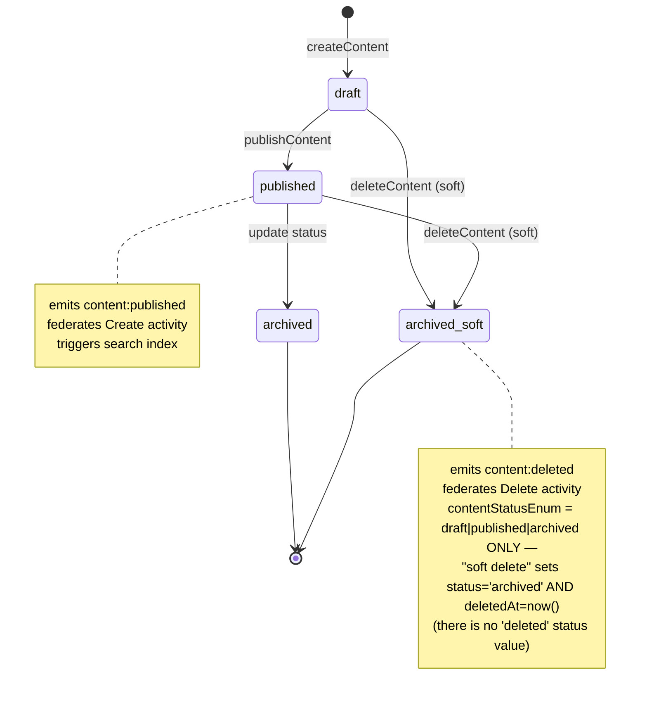

## Contest lifecycle

`contestStatusEnum` has **7 states** (draft + paused added 0017, session 189) and
transitions are **bidirectional** — the server's `VALID_TRANSITIONS` map
(`contest/contest.ts`) is the gating truth. The full edge set (a contest can move
forward or back, e.g. `judging → paused` to re-open submissions):

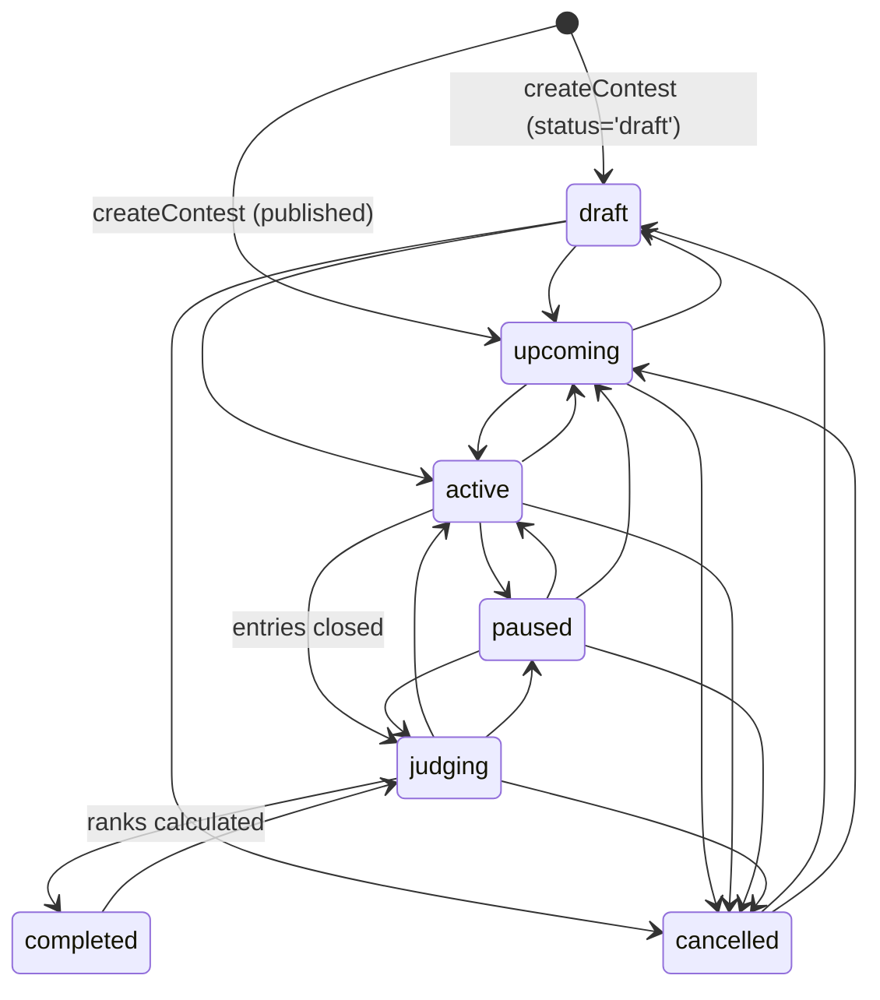

> **Status vs stages.** `status` is the behavioural/gating truth. The `stages` jsonb
> + `currentStageId` (0018) are a **display overlay** = an explicit ordered timeline
> (Submissions → review cohorts → Results); an empty `stages` array makes the server
> synthesize the classic timeline. **Cohort advancement** (`advanceContestStage`,
> `POST /api/contests/:slug/advance`) writes each entry's `stage_state` (0019) to
> `advanced`/`eliminated` (Top-N cull or manual pick). `calculateContestRanks`
> **excludes eliminated entries** (INVARIANT). Judge scores are per-round
> (`JudgeScoreEntry.roundId`); **community voting is advisory** and never drives
> ranks or cuts — only judge score does.

## Contest judges (session 124)

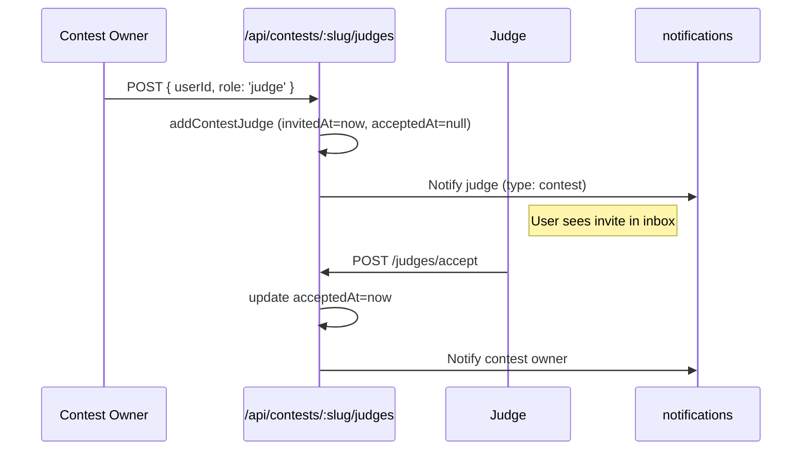

## Events + RSVP

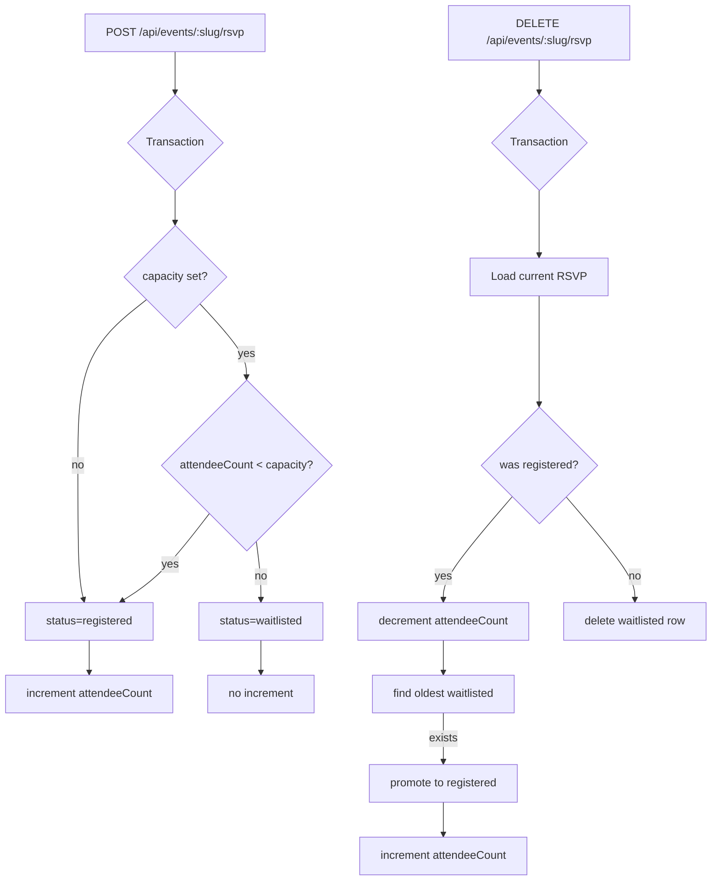

> **Note:** `rsvpEvent`/`cancelRsvp` (events.ts) fire **no notifications and no hooks** — the routes just return status. (`cancelRsvp` returns `promoted: userId` but the route discards it to a bare boolean; nobody is notified.)

## Hub post voting

```mermaid
sequenceDiagram
    participant User
    participant API as /api/hubs/:slug/posts/:postId/vote
    participant DB

    User->>API: POST { direction: 'up' }
    API->>DB: BEGIN TRANSACTION
    DB->>DB: SELECT existing vote
    alt no existing vote
        DB->>DB: INSERT hubPostVote (up)
        DB->>DB: UPDATE hubPosts.voteScore += 1
    else existing vote same direction
        DB->>DB: DELETE hubPostVote
        DB->>DB: UPDATE hubPosts.voteScore -= 1 (for up; +1 for down)
    else existing vote opposite direction
        DB->>DB: UPDATE hubPostVote.direction
        DB->>DB: UPDATE hubPosts.voteScore += 2 (or -2)
    end
    API->>DB: COMMIT
    API->>User: { score, userVote }
```

## Poll voting

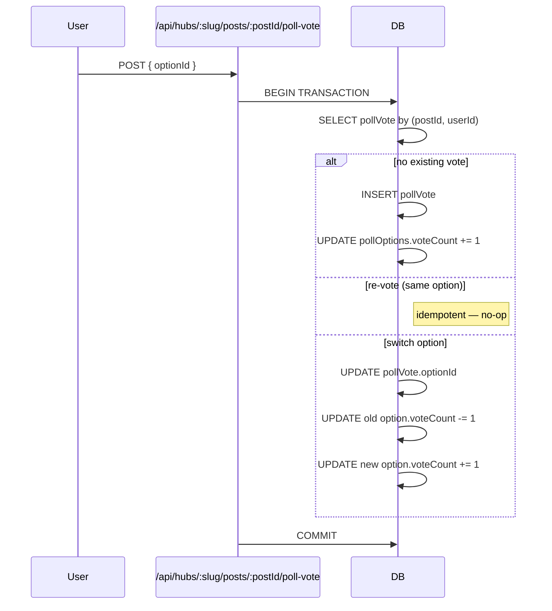

## Hub join flow

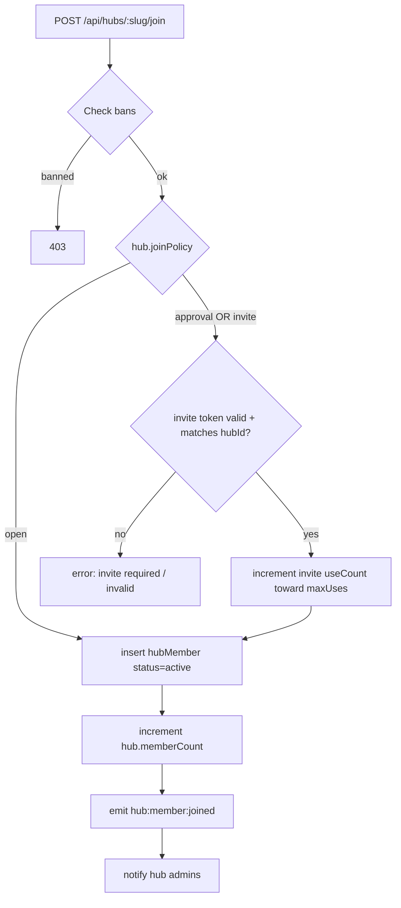

**Note:** `approval` policy currently behaves the same as `invite` —
`joinHub()` requires an invite token for any non-open policy. A separate
request-to-join / admin-approves workflow (using `hubMembers.status =
'pending'`) is not implemented; the `hubMemberStatusEnum('pending')` value
exists in the schema but no code path sets it today.

## ActivityPub federation: outbound delivery

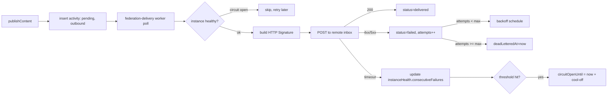

## ActivityPub federation: inbound routing

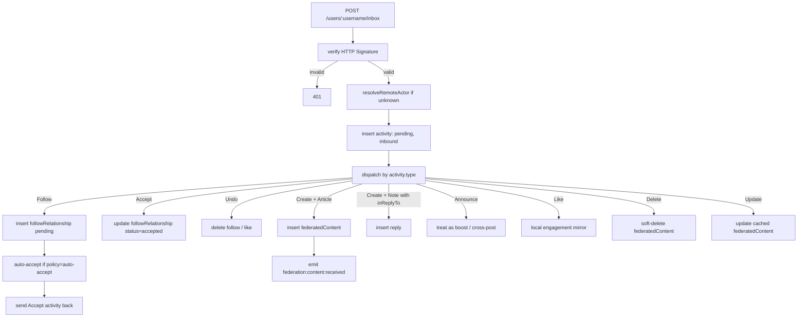

## Hub federation (Group actor, session 083+)

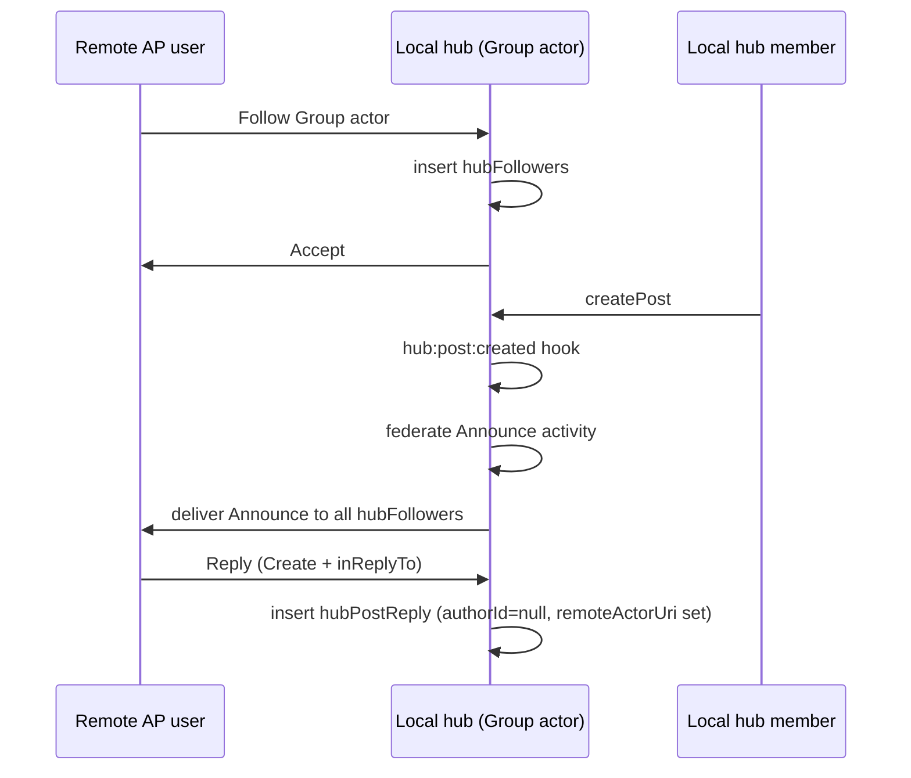

## Instance mirroring (session 079; consent-based push since Phase 3, session 185)

`instanceMirrors` is **PULL-only** now (`createMirror` throws on `direction:'push'`).
"Push" became a **consent request**: `requestMirror` asks a remote to **pull-mirror US**
(i.e. distribute our content) — it sends an `Offer(Follow)` and stores an `outgoing` row;
the remote mirrors us only after its admin approves.

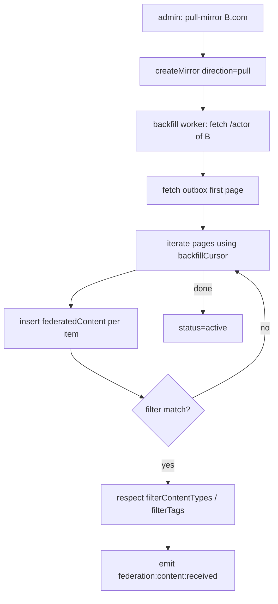

### Consent-based mirror request (Phase 3, session 185)

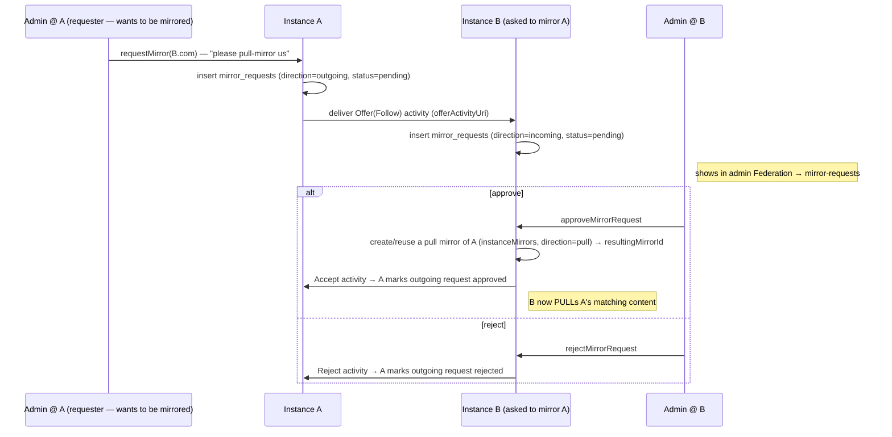

> The `mirror_requests` unique key is `(direction, remote_domain)` — one live request per
> direction per peer. `assertActorMatchesSigner` binds the Accept/Reject signer to the
> claimed actor (see `09`), so a third party can't forge an approval.

## Learning progress

> **Note:** `enrollments` has **no status enum** — these are *derived*
> states, not stored values. The row tracks `progress` (0–100),
> `startedAt`, and a nullable `completedAt`. "in_progress"/"certified" are
> presentation labels; "unenroll" deletes the enrollment row.

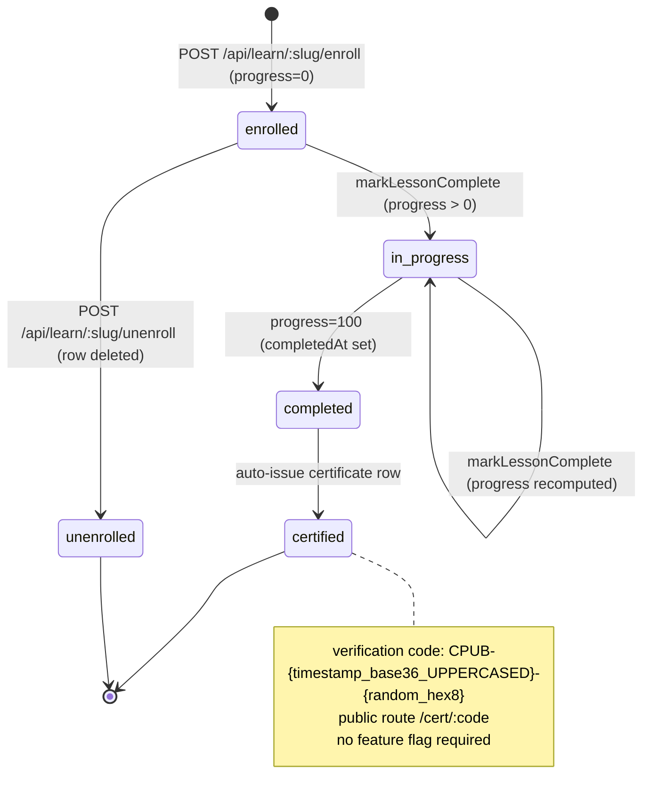

## Homepage rendering

`pages/index.vue` is a 3-way `v-if`: (1) when `features.layoutEngine` is ON
**and** a layout exists at scope `('route','/')`, render via `<LayoutSlot>`
(the live commonpub.io canary); (2) else if configurable sections exist,
the legacy `HomepageSectionRenderer` below; (3) else the hardcoded homepage.
Section `type` strings are **kebab-case** and component names are
`Homepage`-prefixed (Nuxt pathPrefix registration of `components/homepage/*`).

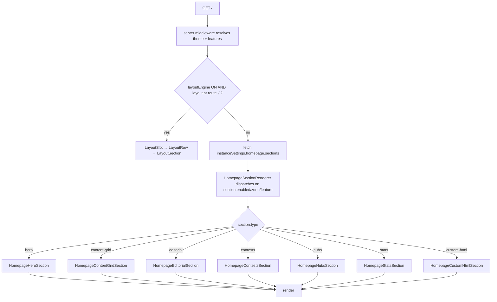

## Navigation rendering (session 124)

```mermaid
flowchart TD
    A[NavRenderer mounts] --> B[fetch /api/navigation/items]
    B --> C[reactive NavItem[] from instanceSettings.nav.items]
    C --> D[filter by feature flags + auth state]
    D --> E{item.type}
    E -->|link| F[NavLink]
    E -->|dropdown| G[NavDropdown]
    G --> H{all children feature-gated out?}
    H -->|yes| I[hide dropdown]
    H -->|no| J[render with filtered children]
    E -->|external| K[target=_blank]
```
